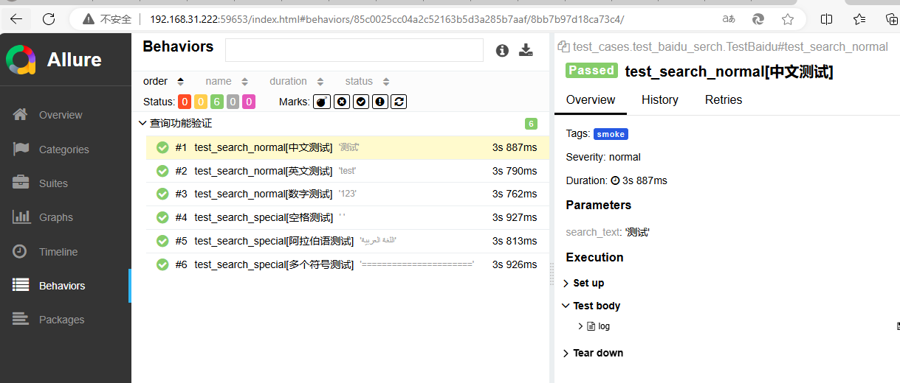
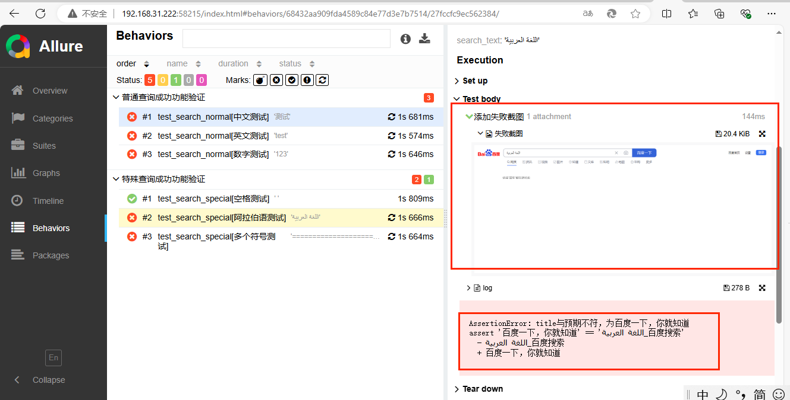

# 项目介绍
## web的UI自动化框架构建
- 本项目实现接口自动化的技术选型：Python+Requests+Pytest+YAML+Allure ，主要是针对百度web搜索页面来开展的，
- 通过 Python7.4.4+selenium4 进行web的UI自动化框架构建，使用 Pytest 作为测试执行器，
- 使用 YAML来管理测试数据，使用 Allure 来生成测试报告。程序入口为：runcase.py文件

# 文件目录
- config/                       # 配置文件(不同环境进行不同的配置，比如URL、账号等)
    - config.yml
    - config-pre.yml
- page/                         # 页面统一封装目录
    - __init__.py
    - baidu_serch.py            # 单个页面元素和页面基本操作都进行封装，PO模式
- screen/                       # 错误自动进行截图的存放目录，虽然是空的，不要删了它呀
- test_cases/                   # 自动化用例目录,具体项目下面还需要再根据模板分文件夹
    - __init__.py
    - conftest.py               # pytest下的指定文件使用
    - test_baidu_search.py      # 具体用例
- test_data                     # 参数化下的用例数据文件
  - test_baidu_search.yaml      # 文件名需要和用例名一致
- utils/                        # 工具类
    - png/                      # 存放项目需要的图片文件
    - __init__.py
    - base_page.py              # 页面封装的父类，对操作进行了一些二次封装
    - config.py                 # 对yaml文件中读取的数据方便进行jsonpath读取的帮助类
    - datas_helper.py           # 用例数据驱动帮助类
    - driver_helper.py          # 驱动帮助类，还未完成，暂时无用
    - file_helper.py            # 文件帮助类
- .gitignore                    # git配置文件
- pytest.ini                    # pytest配置文件
- requirements.txt              # 依赖配置文件

# 报告内容及错误截图展示

